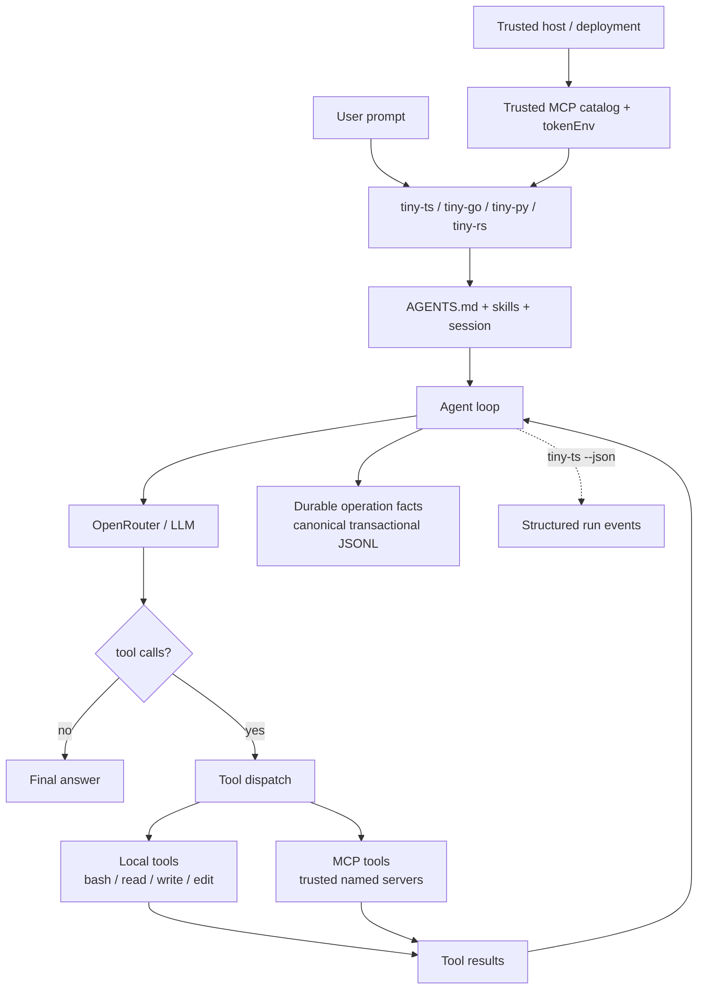

<p align="center">
  
</p>

<h1 align="center">tiny-agent</h1>

<p align="center"><a href="https://tiny-agent.geminixiang.com">閱讀繁體中文教學書</a></p>

用最少概念實作可用的 AI coding agent。這個教學專案會分別用 TypeScript、Python、Rust、Go 完成 POC；目前四種語言版本皆已完成。

## 架構



Agent loop 的核心保持不變；MCP 不改變 tool-call/result 語意。TypeScript、Go 與 Python 將 MCP tools 適配到通用 Tool seam；Rust 目前仍使用獨立的 `McpTool` dispatch，後續再收斂到相同 seam：

```text
messages → model → tool calls → tool results → model
```

## 功能

四種語言共同支援：

- OpenRouter 與可覆寫的 `TINY_MODEL`
- Agent loop 與 `bash`、`read`、`write`、`edit`
- Local `--plugin` capability allowlist
- `AGENTS.md`、skills、durable compaction 與 canonical JSONL session
- Cancellation、token 與 prompt-cache usage
- Trusted named Streamable HTTP MCP servers
- MCP discovery、calling、timeouts、bounds 與 cleanup

TypeScript 另外提供 programmatic injectable `Tool[]` seam 與 `--json` structured monitoring。

核心實作：[`typescript/src/index.ts`](typescript/src/index.ts)、[`typescript/src/tools.ts`](typescript/src/tools.ts)、[`typescript/src/mcp.ts`](typescript/src/mcp.ts)、[`typescript/src/cli.ts`](typescript/src/cli.ts)、[`go/cmd/tiny-go/main.go`](go/cmd/tiny-go/main.go)、[`python/tiny_agent/agent.py`](python/tiny_agent/agent.py)、[`python/tiny_agent/cli.py`](python/tiny_agent/cli.py)、[`rust/src/lib.rs`](rust/src/lib.rs)、[`rust/src/terminal.rs`](rust/src/terminal.rs)。共用的 skills、session schema 與文件留在 repo root。

## 安裝

本專案的安裝與開發前置需求為 Node.js 22+、Go 1.24+、Python 3.12+（由 [uv](https://docs.astral.sh/uv/) 管理）、Rust 1.85+（edition 2024，需 `cargo`），以及 [OpenRouter API key](https://openrouter.ai/settings/keys)：

```bash
git clone https://github.com/geminixiang/tiny-agent.git
cd tiny-agent
make install
export OPENROUTER_API_KEY=sk-or-...
```

這會從 repo root 安裝四個 CLI，且用法一致：

```bash
tiny-ts
tiny-go
tiny-py
tiny-rs
```

使用 `nvm` 切換 Node.js 版本後需再次執行 `make install-ts`。若 shell 找不到 `tiny-go`，請將 `$(go env GOPATH)/bin` 加入 `PATH`。

指定其他 OpenRouter model：

```bash
TINY_MODEL=anthropic/claude-sonnet-4.5 tiny-ts
```

### MCP

四個 CLI 都能從 trusted catalog 載入 MCP tools。使用 `--mcp` 時必須明確設定 `TINY_MCP_CONFIG` 指向 catalog 路徑，沒有預設位置也沒有 home 目錄 fallback；未設定時會直接報錯。

```json
{
    "servers": {
        "sentry": {
            "url": "https://mcp.internal.example/sentry",
            "tokenEnv": "TINY_MCP_TOKEN_SENTRY",
            "allowedTools": ["search_issues", "get_issue"],
            "callTimeoutMs": 30000
        }
    }
}
```

執行任一版本：

```bash
export TINY_MCP_CONFIG=/trusted/path/mcp.json
export TINY_MCP_TOKEN_SENTRY=...
tiny-ts --mcp sentry --plugin read "調查 issue"
tiny-go --mcp sentry --plugin read "調查 issue"
tiny-py --mcp sentry --plugin read "調查 issue"
tiny-rs --mcp sentry --plugin read "調查 issue"
```

`--mcp` 可重複或用逗號分隔。啟動後會顯示實際能力：

```text
MCP sentry: connected (2026-07-28, 2 tools)
tools: read, mcp:sentry/search_issues, mcp:sentry/get_issue
mcp: sentry
```

Catalog 只保存 token 的環境變數名稱；runtime 不會驗證 credential 是否短效。`TINY_MCP_CONFIG` 是唯一的 catalog 來源，不會讀取 repository config，也不接受 CLI 傳入 URL、header 或 token。正式多租戶部署應由 trusted gateway 注入短效、tenant/job-scoped credential；這是部署建議，不是 tiny-agent runtime 保證。

只支援 modern MCP protocol（`2026-07-28`）、`tools/list` 與 `tools/call`；不協商、不降級到任何舊版 protocol，連線到只講舊版 protocol 的 server 會直接失敗並回報清楚錯誤。多租戶部署應連到 trusted gateway；MCP 不是 sandbox 或 authorization boundary。

單次執行：

```bash
tiny-ts "讀取 README 並摘要"
```

Go、Python、Rust 與 TypeScript 版共用 `TINY_MODEL`、`--skill`、`--session` 與 one-shot prompt：

```bash
tiny-go "讀取 README 並摘要"
tiny-py "讀取 README 並摘要"
tiny-rs "讀取 README 並摘要"
```

## 使用

互動指令：

```text
/compact       摘要舊對話，保留至少最近 6 則 message，並將切點移到 user boundary
/skill:i-have-adhd   明確載入 i-have-adhd skill
/exit          結束並顯示 session 恢復指令
Esc            中斷目前的 model、tool 或 compact operation
Ctrl+C         退出並顯示 session 恢復指令
```

`Esc` 是對目前 active phase 發出的控制訊號，不是 agent loop 中的下一個步驟。Agent 會先將 `abortRequested` 寫入 Session，再通知當前的 model、tool 或 compact operation，最後補齊 durable result 與 operation outcome；model 與 tool 取消不是依序執行的兩個階段。

`Ctrl+C` 在有 active operation 時先走同一條 abort 路徑，再結束 CLI。CLI 退出時會關閉 MCP clients 與 Session writer 並恢復 terminal；正常 `/exit` 也會做這些 lifecycle cleanup，但不需要取消 operation。

Tool 執行時只在終端顯示精簡 log：

```text
◆ read README.md
  └ 1.4k chars
```

TUI log 不寫入 session；模型 transcript 所需的 tool call/result 會保存。Bash output 超過 50 KB 時會截短送入模型；若該語言實作已完整捕獲輸出，完整內容會另存於 `.tiny-agent/tool-output/` 並留下回查 path。各實作另有約 10 MB 的 capture safety limit；超限時不保證完整輸出，可能回傳 capped-output 標記或 tool error。確切 cap 與 stdout/stderr 合併方式屬於語言實作限制。

## Session

每次執行都寫入：

```text
.tiny-agent/sessions/<timestamp>_<uuid-v7>.jsonl
```

結束時會顯示：

```bash
tiny-ts --session <session-id>
```

也可恢復後直接送出 prompt：

```bash
tiny-ts --session <session-id> "繼續剛才的工作"
```

Session 使用 canonical transactional JSONL：第一行是 session header，其後每一行是一個完整 transaction。它保存 accepted prompt、model attempt、assistant message，以及即將執行外部 effect 的 tool intent；invalid、unknown 或 truncated tool calls 則保存未執行的 synthetic result。Session 也保存 tool results、abort requests、operation outcomes、compaction checkpoints 與獨立 usage ledger。正式格式與 recovery invariants 見 [`schemas/session.schema.json`](schemas/session.schema.json) 及 [`docs/session-design.md`](docs/session-design.md)。

Process crash 後，`--session` 會先由 durable facts 重建狀態，再執行 recovery plan：不確定的 model request 最多重試一次；只有完全相同的內建 `read` 可安全 replay；`bash`、`write`、`edit`、plugin 與 MCP tool 一律不自動重播。Configuration 或 environment identity 不符時，resume 會停止且不執行 effect。

Session 只承諾 process-crash durability，不承諾 power-loss durability。格式採 single-writer contract；runtime 只在同一 process 內阻止重複 writer，跨 process 互斥必須由外層 job runner 保證。

## Skills 與專案指令

預設掃描：

```text
.tiny-agent/skills/**/SKILL.md
```

啟動時只把 skill 的 `name`、`description`、`location` 放進 system prompt；模型需要時再用 `read` 載入全文。Repo 內附有 [`i-have-adhd` skill](.tiny-agent/skills/i-have-adhd/SKILL.md)，可把後續回答調整成更容易開始與持續執行的格式：

```text
/skill:i-have-adhd 幫我把這個功能拆成可以直接執行的步驟
```

Skill 載入後會持續套用到本次 session，例如首行直接給下一步、將工作編號、重述目前狀態並使用具體時間估計。要停用時輸入：

```text
stop adhd mode
```

若目前目錄存在 `AGENTS.md`，其全文也會加入 system prompt。

## Compact

`/compact` 是獨立的 durable operation。它先從 reducer materialized active context 選擇切點：保留至少最近 6 則 message，再向前移到 user boundary，避免拆散完整 turn。Session 另外記錄截至 `inputThroughEntryId` 的 durable source message-entry partition、digest 與 materialized retained tail；重複 compact 時，prior summary 會參與摘要輸入，但本身不是 source message entry。成功後 active context 改為：

```text
system prompt + compacted summary + retained message tail
```

原始 JSONL records 不刪除，因此 session 仍可 audit 與 resume。主流 coding agent 的做法比較見 [`docs/compaction-comparison.md`](docs/compaction-comparison.md)。

## 開發

所有開發指令都從 repo root 執行：

```bash
make test
make test-mcp     # TypeScript reference MCP fixture；其他語言由各自test suite覆蓋
make check
make format
make build
make book-build
make book-test
```

教學書原始內容位於 [`book/`](book/README.md)，靜態產物可直接部署至 Cloudflare Pages。

個別實作也可使用 `make test-ts`、`make test-go`、`make test-py`、`make test-rs` 等對應 target。普通測試使用 mock OpenRouter，不消耗 API 額度；公開 MCP endpoints 只作 optional compatibility smoke。

## 四語言狀態

| CLI       | Agent / session / skills | MCP | Structured monitoring |
| --------- | -----------------------: | --: | --------------------: |
| `tiny-ts` |                        ✓ |   ✓ |              `--json` |
| `tiny-go` |                        ✓ |   ✓ |                     — |
| `tiny-py` |                        ✓ |   ✓ |                     — |
| `tiny-rs` |                        ✓ |   ✓ |                     — |

四種實作以相同 observable CLI、catalog、tool-result 與 cleanup contract 為目標。Canonical Session reducer 與 recovery planner 由 shared fixtures 直接驗證；MCP、CLI 與 tool lifecycle 目前由各語言測試分別覆蓋，因此仍可能存在語言限制與 observable 差異。

Rust 版使用 `ureq`（blocking HTTP）、`libc` + `unicode-width`（raw terminal 與 CJK 顯示寬度）、`serde`（session/JSON）。model request 設有 connect/read/write timeout；按 Esc 會立即停止前景等待，但 `ureq` 的 blocking transport thread 可能在 timeout 前繼續完成。Bash 工具則會清除整個 process group。

## 致謝

Tiny-agent 的許多設計思考受到 [Pi](https://github.com/earendil-works/pi) 啟發，特別是精簡的 agent loop、Tool 模型、skills 漸進載入、compaction，以及如何讓 coding agent 保持可理解與可操作。感謝 Pi 及其貢獻者公開實作與文件，讓這個專案能站在扎實的工程經驗上繼續拆解、實驗與教學。

Tiny-agent 不是 Pi 的 fork 或移植；它是獨立的四語言教學實作，並針對 transactional Session、crash recovery 與跨語言 conformance 發展自己的 contract。書中提到相關設計時，會盡量區分「源自 Pi 的啟發」、「通用 agent 原理」與「tiny-agent 自己的取捨」。

## License

[MIT](LICENSE) © 2026 Ying Xiang
