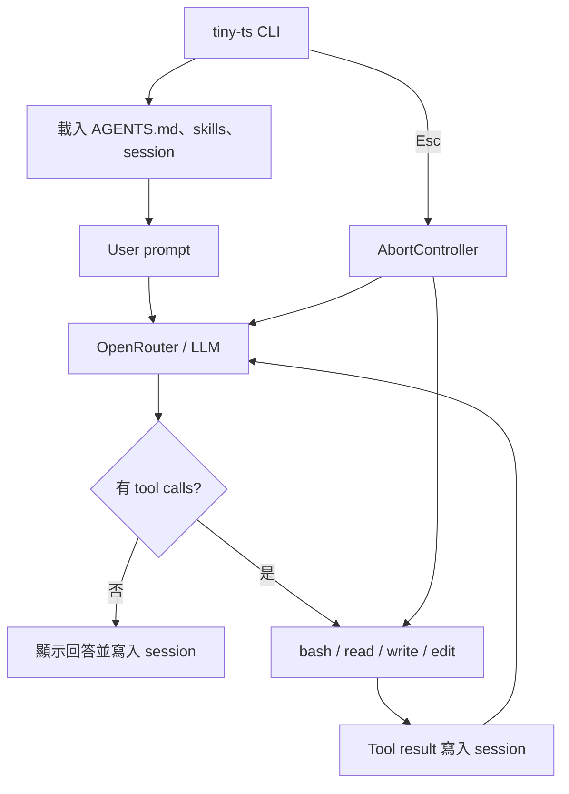

# tiny-agent

用最少概念實作可用的 AI coding agent。這個教學專案會分別用 TypeScript、Python、Rust、Go 完成 POC；目前先完成 TypeScript 版。

## 功能

- OpenRouter；預設 `deepseek/deepseek-v4-flash-0731`
- Agent loop 與 `bash`、`read`、`write`、`edit`
- `.tiny-agent/skills/**/SKILL.md` 漸進載入
- 啟動時讀取 `./AGENTS.md`
- `/compact` 壓縮舊對話
- JSONL session 與 `--session` 恢復
- `Esc` 中斷 model、tool、compaction
- Token、cache usage 與精簡 tool log

核心在 [`src/index.ts`](src/index.ts)，CLI 在 [`src/cli.ts`](src/cli.ts)。

## 安裝

需要 Node.js 22+ 與 [OpenRouter API key](https://openrouter.ai/settings/keys)：

```bash
git clone https://github.com/geminixiang/tiny-agent.git
cd tiny-agent
npm install
npm link
export OPENROUTER_API_KEY=sk-or-...
tiny-ts
```

`npm link` 每個 Node/npm 環境只需執行一次；使用 `nvm` 切換 Node 版本後需重新執行。

指定其他 OpenRouter model：

```bash
TINY_MODEL=anthropic/claude-sonnet-4.5 tiny-ts
```

單次執行：

```bash
tiny-ts "讀取 README 並摘要"
```

## 架構



Agent loop 的核心：

```text
user prompt → model → tool calls → tool results → model → final answer
```

## 使用

互動指令：

```text
/compact       摘要舊對話，保留至少最近 6 則完整 turn
/skill:hello   明確載入 hello skill
/exit          結束並顯示 session 恢復指令
Esc            中斷目前的 model、tool 或 compact operation
Ctrl+C         退出並顯示 session 恢復指令
```

Tool 執行時只在終端顯示精簡 log：

```text
◆ read README.md
  └ 1.4k chars
```

TUI log 不寫入 session；模型 transcript 所需的 tool call/result 會保存。Bash output 超過 50KB 時，完整內容另存於 `.tiny-agent/tool-output/`，session 只保留尾端與回查 path。

## Session

每次執行都寫入：

```text
.tiny-agent/sessions/<timestamp>_<uuid-v7>.jsonl
```

結束時會顯示：

```bash
tiny-ts --session <session-id>
```

也可恢復後直接送出 prompt：

```bash
tiny-ts --session <session-id> "繼續剛才的工作"
```

Session 採 append-only records，保存 message、tool result、compaction、interruption 與 usage。正式格式見 [`schemas/session.schema.json`](schemas/session.schema.json)。

## Skills 與專案指令

預設掃描：

```text
.tiny-agent/skills/**/SKILL.md
```

啟動時只把 skill 的 `name`、`description`、`location` 放進 system prompt；模型需要時再用 `read` 載入全文。Repo 內附有 [`hello` skill](.tiny-agent/skills/hello/SKILL.md)：

```bash
tiny-ts "say hello"
```

若目前目錄存在 `AGENTS.md`，其全文也會加入 system prompt。

## Compact

`/compact` 將較舊對話送給目前模型摘要，active context 改為：

```text
system prompt + compacted summary + 最近至少 6 則完整 turn
```

原始 JSONL records 不刪除，因此 session 仍可 audit 與 resume。主流 coding agent 的做法比較見 [`docs/compaction-comparison.md`](docs/compaction-comparison.md)。

## 開發

```bash
npm run dev
npm run lint
npm run format:check
npm run check
npm test
```

自動排版：

```bash
npm run format
```

測試使用 mock OpenRouter，不消耗 API 額度。

## 四語言路線

1. TypeScript：目前版本
2. Python：待完成
3. Rust：待完成
4. Go：待完成
