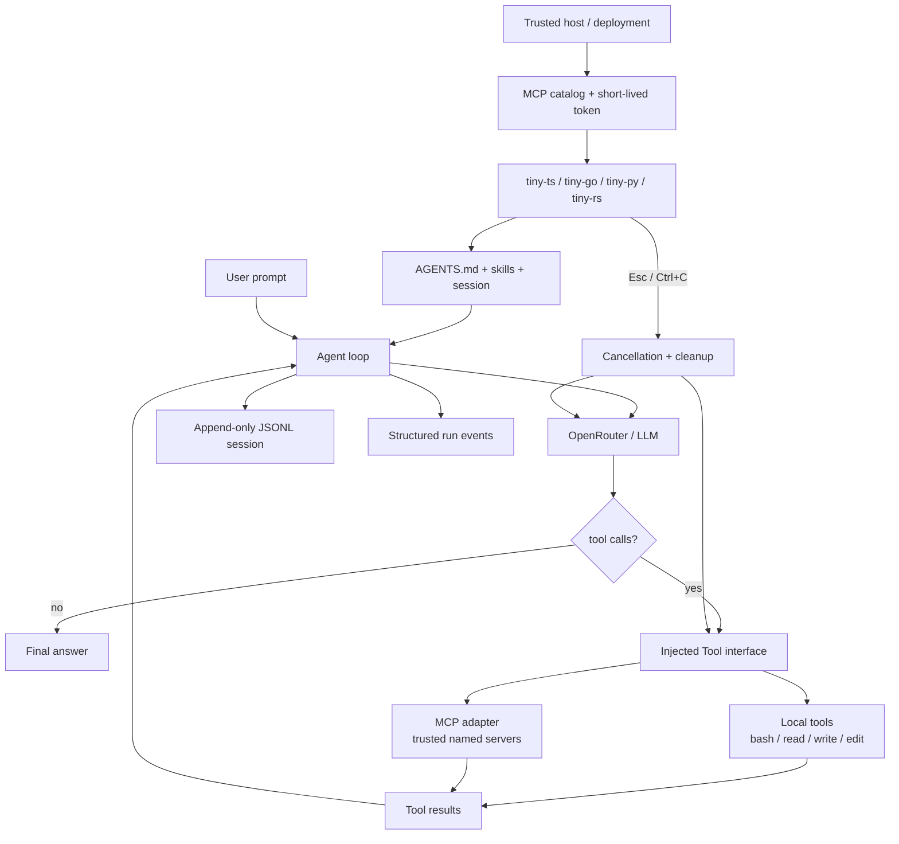

<p align="center">
  
</p>

<h1 align="center">tiny-agent</h1>

用最少概念實作可用的 AI coding agent。這個教學專案會分別用 TypeScript、Python、Rust、Go 完成 POC；目前四種語言版本皆已完成。

## 架構



Agent loop 的核心保持不變；MCP 只是另一種 Tool adapter：

```text
messages → model → tool calls → tool results → model
```

## 功能

四種語言共同支援：

- OpenRouter與可覆寫的 `TINY_MODEL`
- Agent loop與 `bash`、`read`、`write`、`edit`
- `AGENTS.md`、漸進載入 skills、compaction
- Append-only JSONL session與 `--session`恢復
- Model/tool/compaction cancellation
- Token與prompt-cache usage

TypeScript參考實作另外支援：

- Injectable `Tool[]`與trusted local `--plugin` allowlist
- `--json` structured run monitoring
- Trusted named Streamable HTTP MCP servers
- MCP tool discovery、calling、timeouts、bounds與cleanup

核心實作：[`typescript/src/index.ts`](typescript/src/index.ts)、[`typescript/src/tools.ts`](typescript/src/tools.ts)、[`typescript/src/mcp.ts`](typescript/src/mcp.ts)、[`typescript/src/cli.ts`](typescript/src/cli.ts)、[`go/cmd/tiny-go/main.go`](go/cmd/tiny-go/main.go)、[`python/tiny_agent/agent.py`](python/tiny_agent/agent.py)、[`python/tiny_agent/cli.py`](python/tiny_agent/cli.py)、[`rust/src/lib.rs`](rust/src/lib.rs)、[`rust/src/terminal.rs`](rust/src/terminal.rs)。共用的 skills、session schema與文件留在repo root。

## 安裝

需要 Node.js 22+、Go 1.24+、Rust 1.85+（`cargo`）、[uv](https://docs.astral.sh/uv/) 與 [OpenRouter API key](https://openrouter.ai/settings/keys)：

```bash
git clone https://github.com/geminixiang/tiny-agent.git
cd tiny-agent
make install
export OPENROUTER_API_KEY=sk-or-...
```

這會從 repo root 安裝四個 CLI，且用法一致：

```bash
tiny-ts
tiny-go
tiny-py
tiny-rs
```

使用 `nvm` 切換 Node.js 版本後需再次執行 `make install-ts`。若 shell 找不到 `tiny-go`，請將 `$(go env GOPATH)/bin` 加入 `PATH`。

指定其他 OpenRouter model：

```bash
TINY_MODEL=anthropic/claude-sonnet-4.5 tiny-ts
```

### MCP（目前僅 TypeScript）

`tiny-ts` 可從可信的 user/server catalog 載入 MCP tools。預設 catalog 位於：

```text
~/.tiny-agent/mcp.json
```

```json
{
    "servers": {
        "sentry": {
            "url": "https://mcp.internal.example/sentry",
            "tokenEnv": "TINY_MCP_TOKEN_SENTRY",
            "allowedTools": ["search_issues", "get_issue"],
            "callTimeoutMs": 30000
        }
    }
}
```

執行：

```bash
export TINY_MCP_TOKEN_SENTRY=...
tiny-ts --mcp sentry --plugin read "調查 issue"
```

`--mcp`可重複或以逗號分隔；`--plugin`仍是獨立的local capability allowlist。啟動後會顯示實際可用能力：

```text
MCP sentry: connected (2026-07-28, 2 tools)
tools: read, mcp:sentry/search_issues, mcp:sentry/get_issue
mcp: sentry
```

設定檔只保存token的環境變數名稱，不保存token；部署或測試可用 `TINY_MCP_CONFIG=/trusted/path/mcp.json` 指定可信catalog。Tiny-agent不會讀取repository內的MCP設定，也不接受CLI傳入URL、header或token。多租戶環境應連到trusted gateway，tenant ACL與長效credential不應放進agent job。

目前範圍是Streamable HTTP、`tools/list`與`tools/call`。MCP是Tool adapter，不是sandbox或authorization boundary。

單次執行：

```bash
tiny-ts "讀取 README 並摘要"
```

Go、Python、Rust 與 TypeScript 版共用 `TINY_MODEL`、`--skill`、`--session` 與 one-shot prompt：

```bash
tiny-go "讀取 README 並摘要"
tiny-py "讀取 README 並摘要"
tiny-rs "讀取 README 並摘要"
```

## 使用

互動指令：

```text
/compact       摘要舊對話，保留至少最近 6 則完整 turn
/skill:hello   明確載入 hello skill
/exit          結束並顯示 session 恢復指令
Esc            中斷目前的 model、tool 或 compact operation
Ctrl+C         退出並顯示 session 恢復指令
```

Tool 執行時只在終端顯示精簡 log：

```text
◆ read README.md
  └ 1.4k chars
```

TUI log 不寫入 session；模型 transcript 所需的 tool call/result 會保存。Bash output 超過 50KB 時，完整內容另存於 `.tiny-agent/tool-output/`，session 只保留尾端與回查 path。

## Session

每次執行都寫入：

```text
.tiny-agent/sessions/<timestamp>_<uuid-v7>.jsonl
```

結束時會顯示：

```bash
tiny-ts --session <session-id>
```

也可恢復後直接送出 prompt：

```bash
tiny-ts --session <session-id> "繼續剛才的工作"
```

Session 採 append-only records，保存 message、tool result、compaction、interruption 與 usage。正式格式見 [`schemas/session.schema.json`](schemas/session.schema.json)。

## Skills 與專案指令

預設掃描：

```text
.tiny-agent/skills/**/SKILL.md
```

啟動時只把 skill 的 `name`、`description`、`location` 放進 system prompt；模型需要時再用 `read` 載入全文。Repo 內附有 [`hello` skill](.tiny-agent/skills/hello/SKILL.md)：

```bash
tiny-ts "say hello"
```

若目前目錄存在 `AGENTS.md`，其全文也會加入 system prompt。

## Compact

`/compact` 將較舊對話送給目前模型摘要，active context 改為：

```text
system prompt + compacted summary + 最近至少 6 則完整 turn
```

原始 JSONL records 不刪除，因此 session 仍可 audit 與 resume。主流 coding agent 的做法比較見 [`docs/compaction-comparison.md`](docs/compaction-comparison.md)。

## 開發

所有開發指令都從 repo root 執行：

```bash
make test
make test-mcp     # deterministic local MCP fixture，不使用公開server
make check
make format
make build
```

個別實作也可使用 `make test-ts`、`make test-go`、`make test-py`、`make test-rs` 等對應target。普通測試使用mock OpenRouter，不消耗API額度；公開MCP endpoints只作optional compatibility smoke。

## 四語言狀態

| CLI | 核心agent | Session / skills / compact | MCP |
|---|---:|---:|---:|
| `tiny-ts` | ✓ | ✓ | ✓ reference |
| `tiny-go` | ✓ | ✓ | 移植中 |
| `tiny-py` | ✓ | ✓ | 移植中 |
| `tiny-rs` | ✓ | ✓ | 移植中 |

MCP移植以TypeScript行為為contract；各語言應維持相同CLI、catalog、validation、tool result與cleanup語意。

Rust 版使用 `ureq`（blocking HTTP）、`libc` + `unicode-width`（raw terminal 與 CJK 顯示寬度）、`serde`（session/JSON）。model request 設有 connect/read/write timeout；按 Esc 會立即停止前景等待，但 `ureq` 的 blocking transport thread 可能在 timeout 前繼續完成。Bash 工具則會清除整個 process group。

## License

[MIT](LICENSE) © 2026 Ying Xiang
